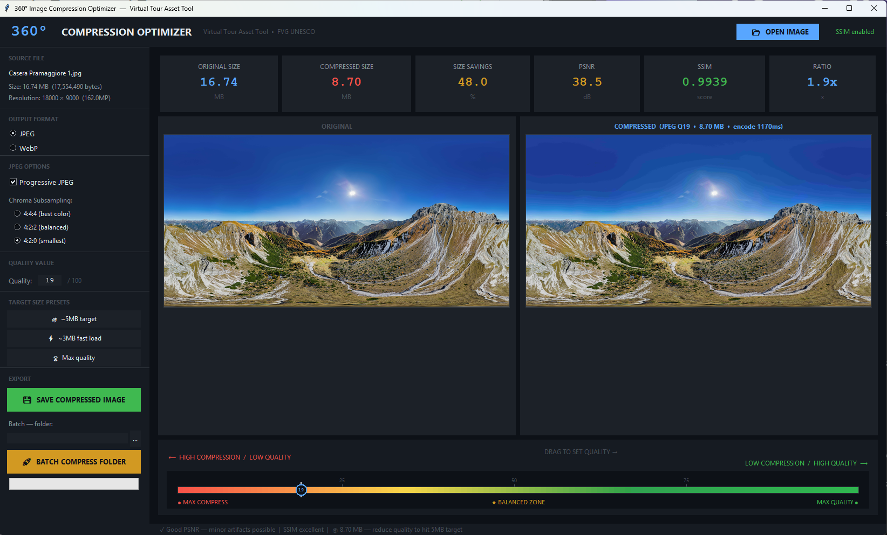

# 360° Image Compression Optimizer
### Professional Tool for Image Compression
---
---

## Preview



---
## 🚀 Instalación rápida

```bash
# 1. Instalar dependencias
pip install Pillow numpy scikit-image

# 2. Ejecutar la herramienta
python 360_optimizer.py

# O abrir directamente con una imagen:
python 360_optimizer.py mi_imagen_360.jpg
```

---

## 🎯 Objetivo

Encontrar el punto óptimo de compresión para imágenes 360° del tour virtual:
- **Original**: ~15 MB por imagen
- **Objetivo**: ~5 MB manteniendo calidad visual
- **Reducción esperada**: 60–70% del tamaño original

---

## 📊 Métricas explicadas

| Métrica | Qué mide | Valor óptimo |
|---------|----------|--------------|
| **PSNR** | Pérdida de señal (dB) | > 40 dB = excelente |
| **SSIM** | Similitud estructural | > 0.97 = excelente |
| **Ratio** | Factor de compresión | 2x–4x = ideal |
| **Savings** | % de reducción | 50–70% = buen punto |

---

## 🎛️ Uso del slider

```
◀─────────────────────────────────────────▶
MAX COMPRESIÓN                 MAX CALIDAD
(archivos pequeños)        (archivos grandes)
Calidad: 1–30              Calidad: 80–100

ZONA ÓPTIMA: Q55–Q75
```

**Punto recomendado para imágenes 360° WebGL:**
- **JPEG Q65** → ~4–6 MB, PSNR ~41 dB ✅
- **WebP Q70** → ~3–5 MB, PSNR ~42 dB ✅ (mejor opción si los navegadores lo soportan)

---

## ⚙️ Opciones avanzadas

**Chroma Subsampling JPEG:**
- `4:4:4` → Mejor color, archivo más grande (+10–15%)
- `4:2:2` → Balance (recomendado para 360°)
- `4:2:0` → Máxima compresión, puede afectar bordes

**Progressive JPEG:**
- ✅ Activar siempre — carga gradualmente en el browser

---

## 🚀 Batch Processing

1. Seleccionar carpeta con todas las imágenes 360°
2. Ajustar calidad con el slider hasta encontrar el punto óptimo
3. Click en **BATCH COMPRESS FOLDER**
4. Las imágenes comprimidas se guardan en `/tu_carpeta/compressed_360/`

---

## 📋 Próximos pasos (implementación en el tour)

Después de determinar la calidad óptima con esta herramienta:

1. **Comprimir todos los assets** con el batch processor
2. **Implementar lazy loading** — cargar la imagen 360° solo cuando el usuario navega a esa escena
3. **Caché profesional** — Service Worker + Cache API para retener imágenes ya visitadas
4. **Formato adaptativo** — WebP para browsers modernos, JPEG como fallback
5. **Preload inteligente** — precargar la siguiente escena mientras el usuario ve la actual
